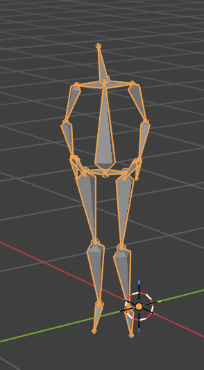

# 2dto3d

Turn a 2D dance video (single phone camera) into an animated 3D skeleton in Blender that
performs the same dance. The output is a keyframed stick-figure armature — no mesh, no
skinning — that you open and press play.

## Why it works

Perspective projection maps a 3D point to the screen with `x' = x/z`, `y' = y/z`. A single
video only gives `(x', y')` — depth `z` is gone, and no algebra recovers it from one view.
What *can* recover it is prior knowledge of the human body: fixed bone lengths, limited
joint ranges, people don't fold impossibly. Rather than hand-write that model, we use
[**MediaPipe Pose**](https://ai.google.dev/edge/mediapipe/solutions/vision/pose_landmarker),
a pretrained monocular estimator that has learned those priors and outputs 33 metric
`(x, y, z)` landmarks per frame.

    video → MediaPipe (x,y,z per joint per frame) → cleanup → Blender armature keyframes

## Usage

    .venv/bin/python dance_to_3d.py [video ...]

With no arguments, every video in `dances/` is processed; each `<name>.<ext>` becomes
`blend-files/<name>.blend` plus a `<name>.preview.png` contact sheet. Open the `.blend`
and press play.

Redraw a preview without rebuilding:

    .venv/bin/python dance_to_3d.py --verify dances/<name>.<ext>

## How it runs

Everything is one self-contained script, `dance_to_3d.py`, with two halves that live in
different interpreters (MediaPipe/OpenCV in the project venv, `bpy` only inside Blender):

1. **extract** (venv) — OpenCV reads frames, MediaPipe estimates per-frame world
   landmarks, they're cleaned (smooth → rigidify → ground-anchor) and written to a temp JSON.
2. **build** (Blender) — builds a stick-figure armature, keyframes it, bakes the
   constraints into bone motion, saves the `.blend`.

The venv half re-invokes Blender on this same file as a subprocess, so you only run one
command. Cleanup handles the things that read as non-human: One Euro filtering (jitter),
bone-length rigidify (MediaPipe limbs stretch 3–5×), and ground-anchoring (plant the feet
so hip movement shows). The finished figure is yawed 45° so hip motion toward the camera —
which is otherwise invisible head-on — reads as a diagonal lean.

## Self-verification

Every build writes `blend-files/<name>.preview.png`: source video frames beside the
reconstructed 3D skeleton at matching timestamps, plus head-on vs top-down hip-path plots.
Reading that image confirms the pose and coordinate conversion without opening Blender —
a wrong axis shows up immediately as a dancer lying down, mirrored, or a hip motion that's
large top-down but flat head-on. (Bones can't be rendered headless — an armature has no
mesh and `render.opengl` needs a GL context — so the preview reads the baked bone
positions back out and plots them.)

## Setup

- Python venv in the project root with `mediapipe`, `opencv-python`, `matplotlib`.
- Blender installed separately. The script calls
  `/Applications/Blender.app/Contents/MacOS/Blender`; override with the `BLENDER` env var.
- Inputs in `dances/`, outputs in `blend-files/`. The MediaPipe model
  (`pose_landmarker_full.task`) auto-downloads on first run.

See `CLAUDE.md` for the detailed technical notes (coordinate systems, cleanup passes,
tuning knobs, VFR handling).
